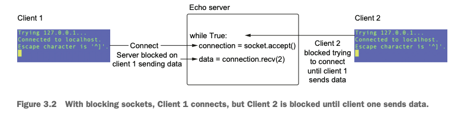
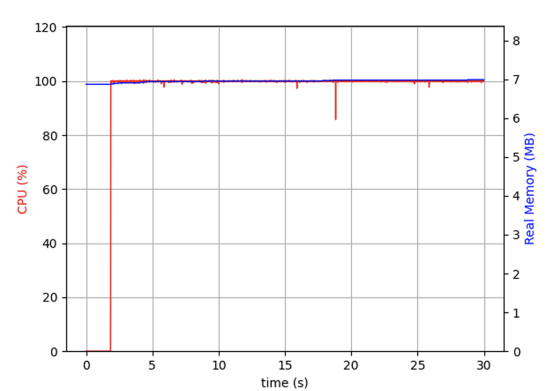
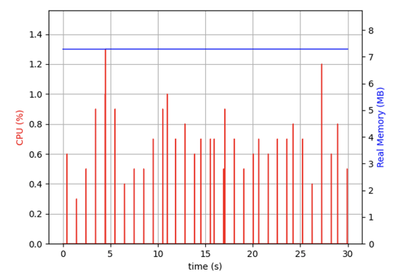

## chapter 3 illustrations: 
### *picture 1. How blocking socket works.*

 
 
 
### *picture 2. How application from file socket_multi_client_connection.py would load CPU.*

 
 
 
### *picture 3. How application from file selectors_and_sockets.py would load CPU.*

