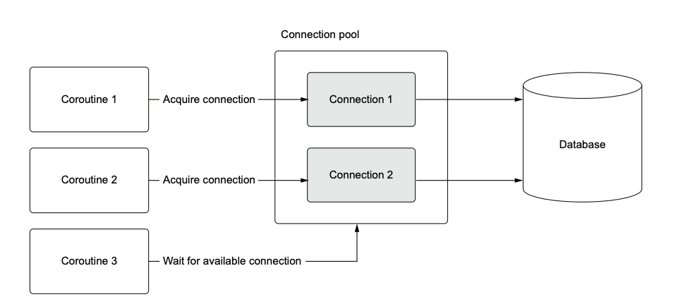

simple how connection pool works in async query mood. 
We are able to send the min size and max size of connections. 
It meants when connection pool is created, it would be created 
with the default number of connections (the mix size). 
If the number of quiries is bigger than number of the minimum size
it would add more connection unill the maximum size of 
allowed connections (the max size). 

Then the connection pool is occupied, the other queries have to wait. 

# Managing transactions 
Transactions are a core concept in many databases that satisfy the ACID (atomic, consistent, isolated, durable) properties. A transaction consists of one or more SQL statements that are executed as one atomic unit. If no errors occur when we execute the
statements within a transaction, we commit the statements to the database, making any
changes a permanent part of the database. If there are any errors, we roll back the statements, and it is as if none of them ever happened. 

## Nested transactions
A nested transaction is a database or programming transaction 
that is started within the scope (or "bracket") of an 
already existing parent transaction.

asyncpg also supports the concept of a nested transaction through a Postgres feature
called savepoints. Savepoints are defined in Postgres with the SAVEPOINT command.
When we define a savepoint, we can roll back to that savepoint and any queries executed
after the savepoint will roll back, but any queries successfully executed before it will
not roll back.