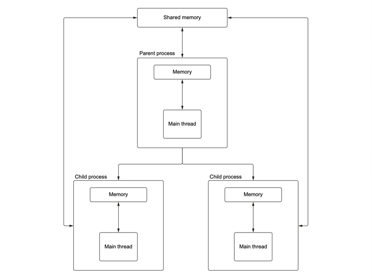
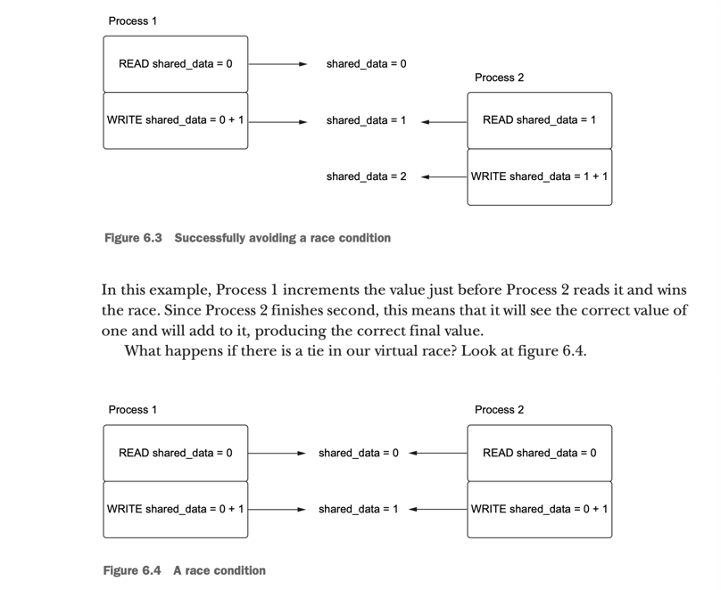
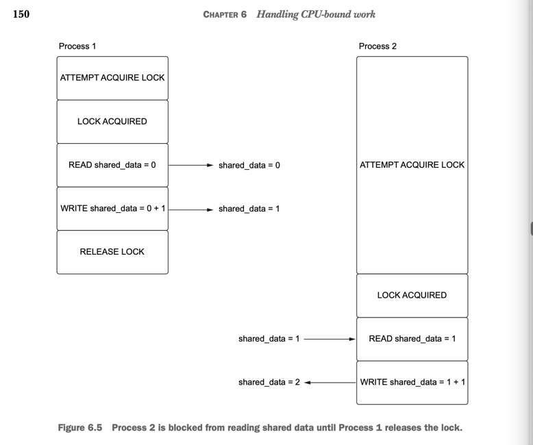

In the example that was provided
in multiprocessing_into.py we may understand 
how actually it works. 

But there are the critical issues like: 
being not able to get the result of the 
process, calling start and join all the time 

So multiprocessing module has an API that 
lets us deal with this issue, called process pools.

# Process Pool 
Process pools are a concept similar to the connection pools that we saw in chapter 5. The difference in this case is that, instead of a collection of connections to a
database, we create a collection of Python processes that we can use to run functions
in parallel. When we have a CPU-bound function we wish to run in a process, we ask
the pool directly to run it for us. Behind the scenes, this will execute this function in
an available process, running it and returning the return value of that function

However, the example that is provided in process_pool.py is away from perfect, because
of one simple problem. It's still blocking the main process, which negate the point of 
running in parallel. To avoid this we are able to apply function async, like literally using 
```apply_async()```

# MapReduce 


# Sheared Memory 
Mutliprocessing supports a concept called ```shared memeory object```
It is a chunk of memory allocated that a set of separate process 
can access. 

Each process can them read and write into that memory space as needed. 

However, the implementation is complicated and may lead to hard-ro-reproduce
bugs if not properly provided. In general, it is best to avoid shared state if 
possible. But, in some case it is super necessary, like it shared counter.  



Multiprocessing supports two kinds of shared data: values and array.

Sharing data objects without control may lead to Race condition problems: 


the solution is easy. We have to lock the thread every time we're calling a 
method which is able to change it state of the object


Notice that we have taken concurrent code and have just forced it to be sequential,
negating the value of running in parallel. This is an important observation and is a
caveat of synchronization and shared data in concurrency in general. To avoid race
conditions, we must make our parallel code sequential in critical sections. This can
hurt the performance of our multiprocessing code. Care must be taken to lock only
the sections that absolutely need it so that other parts of the application can execute
concurrently. When faced with a race condition bug, it is easy to protect all your
code with a lock. This will “fix” the problem but will likely degrade your application’s performance.