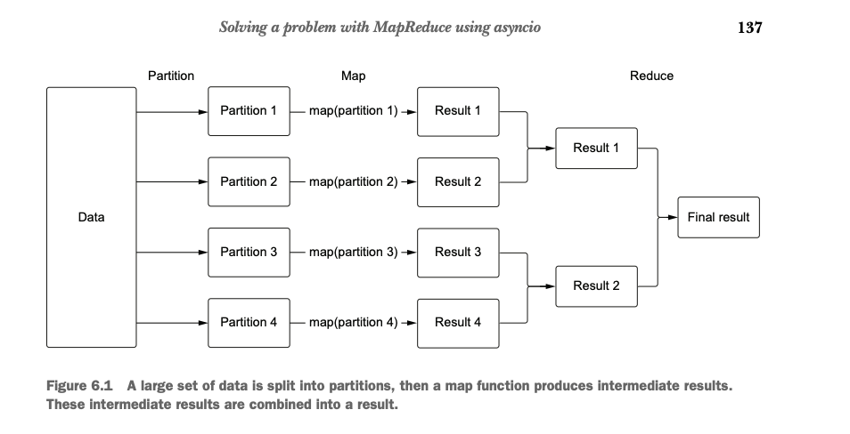

In the example that was provided
in multiprocessing_into.py we may understand 
how actually it works. 

But there are the critical issues like: 
being not able to get the result of the 
process, calling start and join all the time 

So multiprocessing module has an API that 
lets us deal with this issue, called process pools.

# Process Pool 
Process pools are a concept similar to the connection pools that we saw in chapter 5. The difference in this case is that, instead of a collection of connections to a
database, we create a collection of Python processes that we can use to run functions
in parallel. When we have a CPU-bound function we wish to run in a process, we ask
the pool directly to run it for us. Behind the scenes, this will execute this function in
an available process, running it and returning the return value of that function

However, the example that is provided in process_pool.py is away from perfect, because
of one simple problem. It's still blocking the main process, which negate the point of 
running in parallel. To avoid this we are able to apply function async, like literally using 
```apply_async()```

# MapReduce 
